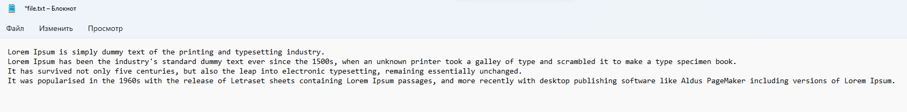
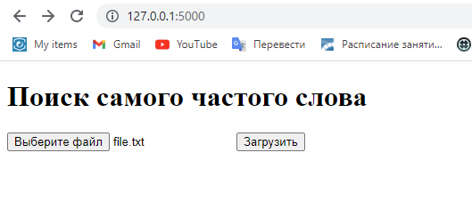
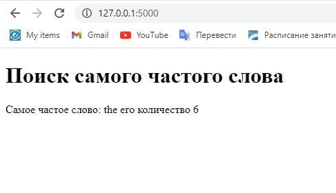

# Телеграмм-бот PYTHON-FLASK-FIND-MOST-COMMOND-WORD
PYTHON-FLASK-FIND-MOST-COMMOND-WORD - это веб приложение сделанное на Flask, которое позволяет найти самое частое слово в .txt файле

# Использование
- Запустить приложение
- Перейти по адресу http://127.0.0.1:5000
- Вставить файл и нажать на кнопку "загрузить"
- Посмотреть какое слово самое частое в файле

# Для работы бота нужно:
- Python 3.7 +
- Библиотеки:
- Flask
# Пример работы с ботом

