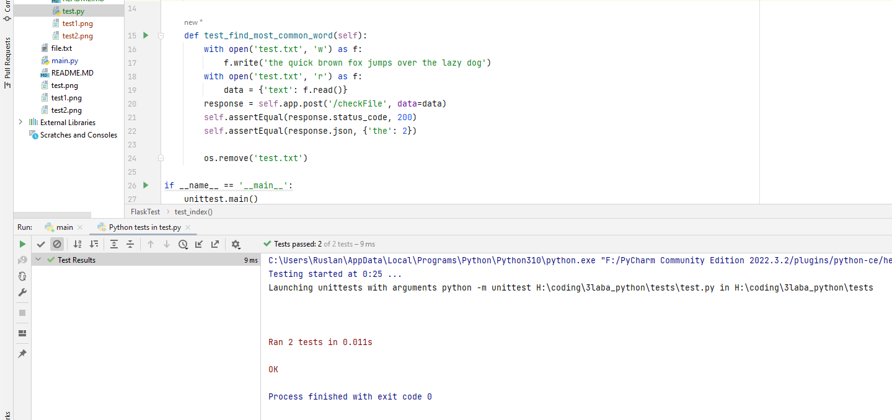

# Тесты для YTHON-FLASK-FIND-MOST-COMMOND-WORD
# Первый тест 'test_index'
Он проверяет успешно ли запускается индексная страница или нет (по статусу)
К примеру, вот успешно:

А вот неуспешно:

# Второй тест 'test_find_most_common_word'
Он проверяет правильно ли работает алгоритм поиска частых слов, он создае файл, отправляет его и проверяет, после удаляет файл
К примеру, вот успешно:

А вот неуспешно:

А вот тоже неуспешно:

Как видно, все тесты правильно работают.